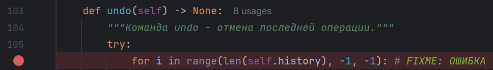
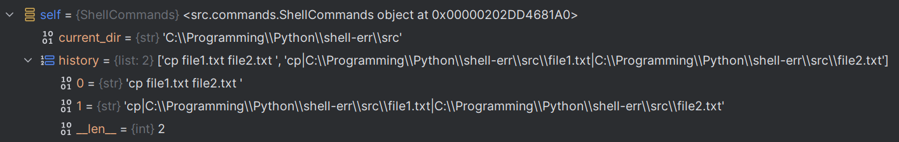
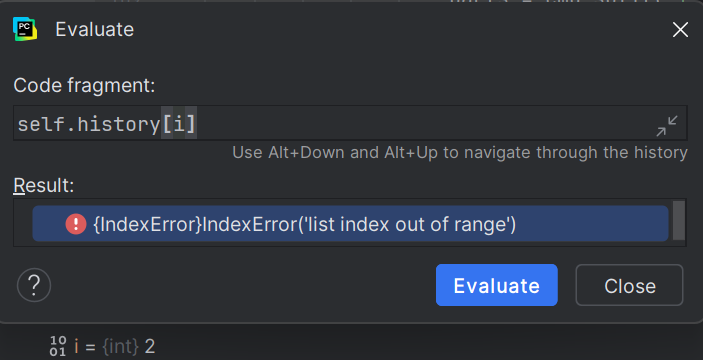
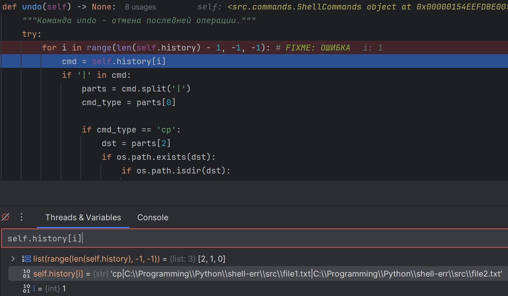
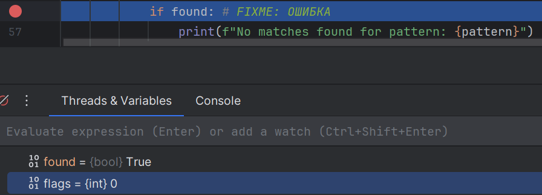
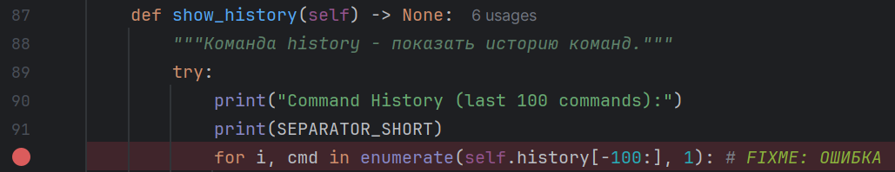
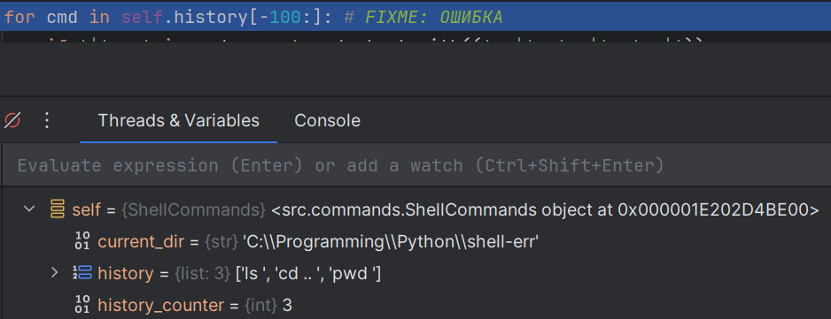
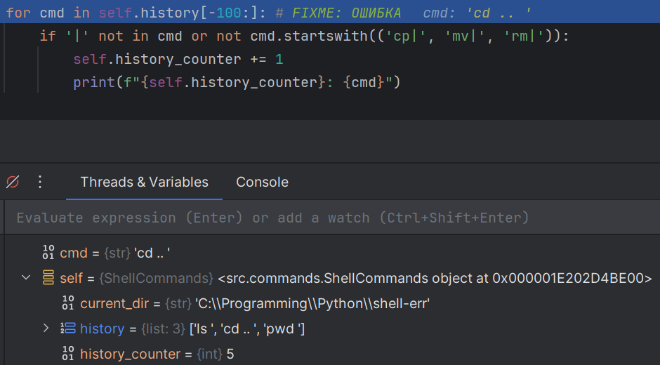
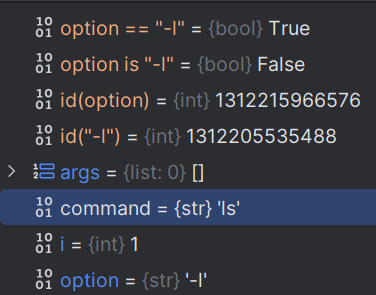
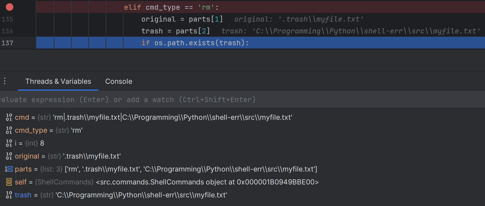

# Лабораторная работа №5

Для выполнения использую лабораторную работу №2: https://github.com/v0sm/shell#

## Ошибка 1 — off-by-one (выход за границы массива)

### Место
`advanced.py`, метод `undo()`, строка 103

### Симптом
При выполнении команды `undo` возникает исключение `IndexError: list index out of range`.

### Как воспроизвести
1. Выполните команду: `cp file1.txt file2.txt`
2. Выполните команду: `undo`
3. Получите исключение IndexError

### Отладка
Установлен breakpoint на строке `for i in range(len(self.history), -1, -1):`.


В панели Variables видно, что `len(self.history) = 2`, следовательно индексы массива: `[0, 1]`.


При выполнении Evaluate Expression для `list(range(len(self.history), -1, -1))` получаем `[2, 1, 0]`.


При Step Over переходим к строке `cmd = self.history[i]`, где `i = 2` — выход за границы массива.


В стеке вызовов видно, что исключение возникает именно на этой строке.

### Причина
Использован неверный диапазон в цикле: `range(len(self.history), -1, -1)` начинается с длины массива, а не с последнего индекса (`len(self.history) - 1`). Это классическая ошибка off-by-one.

### Исправление
for i in range(len(self.history) - 1, -1, -1):

### Проверка
Команда `undo` корректно отменяет последнюю операцию без исключений.

### Доказательство:


---

## Ошибка 2 — неверное логическое условие

### Место
`advanced.py`, метод `grep()`

### Симптом
Сообщение "No matches found for pattern" выводится даже когда найдены совпадения в файле.

### Как воспроизвести
1. Создайте файл hello.txt с текстом "hello world"
2. Выполните команду: `grep hello hello.txt`
3. На экране появятся найденные строки И сообщение "No matches found"

### Отладка
Установлен breakpoint на условии `if found:`.

В панели Variables видно: `found = True`.

Это означает, что условие срабатывает даже при успешном поиске, так как `found = True` делает всё выражение истинным.

### Причина
Использовано некорректное логическое условие `if found:` вместо `if not found:`. Логическая ошибка приводит к тому, что сообщение об отсутствии совпадений печатается при любом успешном поиске.

### Исправление
```
if not found:
print(f"No matches found for pattern: {pattern}")
```

### Проверка
Сообщение "No matches found" теперь выводится только когда действительно ничего не найдено.

---

## Ошибка 3 — ошибка состояния (флаг не сбрасывается)

### Место
`advanced.py`, метод `show_history()`; `base.py`, метод `__init__()`

### Симптом
Нумерация команд в истории начинается не с 1, а продолжается с номера, на котором закончился предыдущий вызов `history`.

### Как воспроизвести
1. Выполните команды: `ls`, `cd ..`, `pwd`
2. Выполните: `history` → вывод: `1: ls`, `2: cd ..`, `3: pwd`
3. Снова выполните: `history` → вывод: `4: ls`, `5: cd ..`, `6: pwd` (должно быть 1-3)

### Отладка
Установлен breakpoint в методе `show_history()` перед циклом `for cmd in self.history[-100:]:`.


В панели Variables видно, что `self.history_counter = 3` (значение от предыдущего вызова).


При Step Over через цикл видно, как счетчик инкрементируется: 4, 5, 6, 7...


### Причина
Счетчик `self.history_counter` объявлен как атрибут экземпляра класса в `BaseCommands.__init__()` и накапливается между вызовами метода. Флаг состояния не сбрасывается перед каждым выводом истории.

### Исправление
```
def show_history(self) -> None:
    try:
    print("Command History (last 100 commands):")
    print(SEPARATOR_SHORT)
        for i, cmd in enumerate(self.history[-100:], 1): # i вместо self.history_counter
            if '|' not in cmd or not cmd.startswith(('cp|', 'mv|', 'rm|')):
                print(f"{i}: {cmd}")
        
        self.logger.log_success("history")
    except Exception as e:
        self.logger.log_error(f"history failed: {e}")
        print(f"Error: {e}")
```

### Проверка
Каждый вызов `history` теперь нумерует команды с 1.

---

## Ошибка 4 — сравнение через is вместо ==

### Место
`shell.py`, метод `parse_command()`

### Симптом
Опции `-l` могут не распознаваться командами. Например, `ls -l` иногда показывает обычный вывод вместо детального.

### Как воспроизвести
1. Выполните: `ls -l` → может не показать детальную информацию
2. Поведение нестабильно из-за интернирования строк в Python

### Отладка
Установлен breakpoint на строке `if option is '-l':`.

В панели Variables видно: `option = '-l'`.

Evaluate Expression: `option == '-l'` → `True`.

Evaluate Expression: `option is '-l'` → `False` (может варьироваться).

Evaluate Expression: `id(option)` и `id('-l')` → разные адреса памяти.



Оператор `is` сравнивает идентичность объектов (адреса в памяти), а не их значения.

### Причина
Использован оператор `is` для сравнения строк вместо оператора `==`. Оператор `is` проверяет идентичность объектов в памяти, что работает нестабильно из-за механизма интернирования строк в Python.

### Исправление
```
if option == '-l':
options['detailed'] = True
```

### Проверка
Все опции команд теперь распознаются стабильно.

---

## Ошибка 5 — перепутанные аргументы

### Место
`filesystem.py`, метод `rm()`

### Симптом
При выполнении `undo` после удаления файла командой `rm` файл не восстанавливается или появляется ошибка "not found in trash".

### Как воспроизвести
1. Создайте файл `myfile.txt`
2. Выполните: `rm myfile.txt`
3. Выполните: `undo`
4. Получите ошибку или файл восстановлен в неправильное место

### Отладка
Выполнен `rm myfile.txt`, затем установлен breakpoint в методе `undo()` на обработке команды типа `'rm'`.

В панели Variables видно: `parts = ['rm', '.trash/myfile.txt', '/home/user/myfile.txt']`.

Далее видно: `original = '.trash/myfile.txt'` (это неправильно, должен быть исходный путь).

И `trash = '/home/user/myfile.txt'` (это неправильно, должен быть путь в корзине).


### Причина
В методе `rm()` при сохранении информации для отмены операции перепутан порядок аргументов: `undo_info = f"rm|{trash_path}|{target}"` вместо правильного `f"rm|{target}|{trash_path}"`. При разборе в методе `undo()` получается обратная логика.

### Исправление
В методе rm():
```
undo_info = f"rm|{target}|{trash_path}"
```

### Проверка
Команда `undo` после `rm` корректно восстанавливает файл в исходное место.
